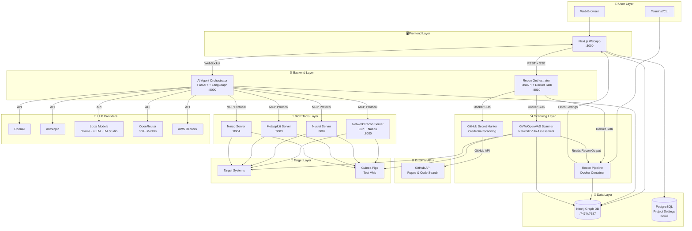

<p align="center">
  
  <br/>
  
  <br/>
  <b><i><big><big>Unmask the hidden before the world does</big></big></i></b>
</p>
<p align="center" style="font-size: 120%;">
  An autonomous AI framework that chains reconnaissance, exploitation, and post-exploitation into a single pipeline, then goes further by triaging every finding, implementing code fixes, and opening pull requests on your repository. From first packet to merged patch, with human oversight at every critical step.
</p>

<br/>

<p align="center">
  
  
  
  
  
  
  
  
  
  
  
  
  
  
  
  
  
  
  
  
  
  
  
  <a href="https://github.com/samugit83/redamon/wiki"></a>
</p>

> **LEGAL DISCLAIMER**: This tool is intended for **authorized security testing**, **educational purposes**, and **research only**. Never use this system to scan, probe, or attack any system you do not own or have explicit written permission to test. Unauthorized access is **illegal** and punishable by law. By using this tool, you accept **full responsibility** for your actions. **[Read Full Disclaimer](DISCLAIMER.md)**

<p align="center">
  
</p>
<p align="center">
  <a href="https://youtu.be/afViJUit0xE"></a>
</p>
<p align="center">
  <em>Three AI agents test in parallel — one validates credential policies via Hydra, one verifies a CVE exploit path through privilege escalation, one maps XSS vulnerabilities across the frontend.</em>
</p>

<br/>

<h1 align="center"><span style="color:#D48A8A">Offense</span> meets <span style="color:#8AAED4">defense</span> — one pipeline, full visibility.</h1>
<p align="center">
<b><samp><big>Reconnaissance ➜ Exploitation ➜ Post-Exploitation ➜ AI Triage ➜ CodeFix Agent ➜ GitHub PR</big></samp></b>
<br/><br/>
RedAmon doesn't stop at finding vulnerabilities, it fixes them. The pipeline starts with a 6-phase reconnaissance engine that maps your target's entire attack surface, then hands control to an autonomous AI agent that validates CVE exploitability, tests credential policies, and maps lateral movement paths. Every finding is recorded in a Neo4j knowledge graph. When the offensive phase completes, CypherFix takes over: an AI triage agent correlates hundreds of findings, deduplicates them, and ranks them by exploitability. Then a CodeFix agent clones your repository, navigates the codebase with 11 code-aware tools, implements targeted fixes, and opens a GitHub pull request, ready for review and merge.
</p>

<p align="center">

</p>

---

## Roadmap & Community Contributions

We maintain a public **[Project Board](https://github.com/users/samugit83/projects/1)** with upcoming features open for community contributions. Pick a task and submit a PR!


> **Want to contribute?** See [CONTRIBUTING.md](CONTRIBUTING.md) for how to get started.

### Contributors Wall of Fame

A special thanks to the people who go above and beyond — contributing code, spreading the word, and helping shape RedAmon into a better tool for the community. These are our project champions and evangelists. See [CONTRIBUTING.md](CONTRIBUTING.md#contributor-ranks) for how ranks work.

| Contributor | Rank | Tracks | GitHub |
|------------|------|--------|--------|
| defektive | First Blood | Feature Builder | [github.com/defektive](https://github.com/defektive) |
| vishalsingh-arch | First Blood | Feature Builder | [github.com/vishalsingh-arch](https://github.com/vishalsingh-arch) |

### Community Showcase

Videos, writeups, and real-world experiences from security professionals using RedAmon in the field. Want to be featured? See the [Content Creator](CONTRIBUTING.md#content-creator) track in CONTRIBUTING.md.

#### Videos

| Title | Link |
|-------|------|
| RedAmon v2.2.0 — Social Engineering Test: Payload Delivery to Shell Access | [Watch](https://youtu.be/kVjV9K_eks4) |
| AI Agent CVE Validation — Beyond Standard Tooling | [Watch](https://youtu.be/rypmP1SJon8) |
| RedAmon 2.0 — From 0 to 1000 GitHub Stars in 10 Days: Multi-Agent Parallel Attacks | [Watch](https://youtu.be/afViJUit0xE) |
| Build an Autonomous AI Red Team Agent from Scratch — LangGraph + Metasploit + Neo4j Full Tutorial | [Watch](https://youtu.be/mO5CCkYlY94) |

#### Real-World Case Studies

| Who | What | Link |
|-----|------|------|
| Nipun Dinudaya | Deployed RedAmon on a company website — identified a critical SQL injection vulnerability that could have caused significant data exposure | [Read on LinkedIn](https://www.linkedin.com/posts/nipun-dinudaya-6159b32bb_redamon-cybersecurity-penetrationtesting-ugcPost-7431233870253166592-aLvb) |
| Venkata Bhargav CH S | Used RedAmon during an internship at Ascent e-Digit Solutions — hands-on reconnaissance, DNS analysis, and attack surface mapping | [Read on LinkedIn](https://www.linkedin.com/posts/venkata-bhargav-cybersecurity_cybersecurity-ethicalhacking-redteam-share-7434940660803182592-e9En) |

### Maintainers

<table>
<tr>
<td align="center" valign="top" width="50%">
<br/>
<b>Samuele Giampieri</b> — Creator, Maintainer & AI Platform Architect<br/><br/>
<small>AI Platform Architect & Full-Stack Lead with 15+ years of freelancing experience and more than 30 projects shipped to production, including enterprise-scale AI agentic systems. AWS-certified (DevOps Engineer, ML Specialty) and IBM-certified AI Engineer. Designs end-to-end ML solutions spanning deep learning, NLP, Computer Vision, and AI Agent systems with LangChain/LangGraph.</small><br/><br/>
<a href="https://www.linkedin.com/in/samuele-giampieri-b1b67597/">LinkedIn</a> · <a href="https://github.com/samugit83">GitHub</a> · <a href="https://www.devergolabs.com/">Devergo Labs</a>
</td>
<td align="center" valign="top" width="50%">
<br/>
<b>Ritesh Gohil</b> — Maintainer & Lead Security Researcher<br/><br/>
<small>Cyber Security Engineer at Workday with over 7 years of experience in Web, API, Mobile, Network, and Cloud penetration testing. Published 11 CVEs in MITRE, with security acknowledgements from Google (4×) and Apple (6×). Secured 200+ web and mobile applications and contributed to Exploit Database, Google Hacking Database, and the AWS Community. Holds AWS Security Specialty, eWPTXv2, eCPPTv2, CRTP, and CEH certifications with expertise in red teaming, cloud security, CVE research, and security architecture review.</small><br/><br/>
<a href="https://www.linkedin.com/in/riteshgohil25/">LinkedIn</a> · <a href="https://github.com/L4stPL4Y3R">GitHub</a>
</td>
</tr>
</table>

---

## Quick Start

### Prerequisites

- [Docker](https://docs.docker.com/get-docker/) & Docker Compose v2+

That's it. No Node.js, Python, or security tools needed on your host.

#### Minimum System Requirements

| Resource | Without OpenVAS | With OpenVAS (full stack) |
|----------|----------------|--------------------------|
| **CPU** | 2 cores | 4 cores |
| **RAM** | 4 GB | 8 GB (16 GB recommended) |
| **Disk** | 20 GB free | 50 GB free |

> **Without OpenVAS** runs 6 containers: webapp, postgres, neo4j, agent, kali-sandbox, recon-orchestrator.
> **With OpenVAS** adds 4 more runtime containers (gvmd, ospd-openvas, gvm-postgres, gvm-redis) plus ~8 one-shot data-init containers for vulnerability feeds (~170K+ NVTs). First launch takes ~30 minutes for GVM feed synchronization.
> Dynamic recon and scan containers are spawned on-demand during operations and require additional resources.

### 1. Clone & Configure

```bash
git clone https://github.com/samugit83/redamon.git
cd redamon
```

After starting the stack, open **http://localhost:3000/settings** (gear icon in the header) to configure everything. No `.env` file is needed — all configuration is done from the UI.

- **LLM Providers** — add API keys for OpenAI, Anthropic, OpenRouter, AWS Bedrock, or any OpenAI-compatible endpoint (Ollama, vLLM, Groq, etc.). Each provider can be tested before saving. The model selector in project settings **dynamically fetches** available models from configured providers.
- **API Keys** — Tavily, Shodan, SerpAPI, NVD, Vulners, and URLScan keys to enable extended agent capabilities (web search, OSINT, CVE lookups). Supports **key rotation** — configure multiple keys per tool with automatic round-robin rotation to avoid rate limits.
- **Tunneling** — configure ngrok or chisel for reverse shell tunneling. Changes apply immediately without container restarts.

All settings are stored per-user in the database. See the **[AI Model Providers](https://github.com/samugit83/redamon/wiki/AI-Model-Providers)** wiki page for detailed setup instructions.

### 2. Build & Start

**Without GVM (lighter, faster startup):**
```bash
docker compose --profile tools build          # Build all images
docker compose up -d postgres neo4j recon-orchestrator kali-sandbox agent webapp   # Start core services only
```

**Complete, With GVM:**
```bash
docker compose --profile tools build          # Build all images (recon + vuln-scanner + services)
docker compose up -d                          # Start all services (first GVM run takes ~30 min for feed sync)
                                              # Total image size: ~15 GB
```


### 3. Open the Webapp

Go to **http://localhost:3000** — create a project, configure your target, and start scanning.

> For a detailed walkthrough of every feature, check the **[Wiki](https://github.com/samugit83/redamon/wiki)**.
>
> Having issues? See the **[Troubleshooting](readmes/TROUBLESHOOTING.md)** guide or the **[Wiki Troubleshooting](https://github.com/samugit83/redamon/wiki/Troubleshooting)** page.

### Common Commands

```bash
docker compose ps                           # Check service status
docker compose logs -f                      # Follow all logs
docker compose logs -f webapp               # Webapp (Next.js)
docker compose logs -f agent                # AI agent orchestrator
docker compose logs -f recon-orchestrator   # Recon orchestrator
docker compose logs -f kali-sandbox         # MCP tool servers
docker compose logs -f gvmd                 # GVM vulnerability scanner daemon
docker compose logs -f neo4j                # Neo4j graph database
docker compose logs -f postgres             # PostgreSQL database

# Stop services without removing volumes (preserves all data, fast restart)
docker compose down

# Stop and remove locally built images (forces rebuild on next start)
docker compose --profile tools down --rmi local

# Full cleanup: remove all containers, images, and volumes (destroys all data!)
docker compose --profile tools down --rmi local --volumes --remove-orphans
```

### Development Mode

For active development with **Next.js fast refresh** (no rebuild on every change):

**Without GVM (lighter, faster startup):**
```bash
docker compose -f docker-compose.yml -f docker-compose.dev.yml up -d postgres neo4j recon-orchestrator kali-sandbox agent webapp

```
**Complete, With GVM:**
```bash
docker compose -f docker-compose.yml -f docker-compose.dev.yml up -d
```

Both commands swap the production webapp image for a dev container with your source code volume-mounted. Every file save triggers instant hot-reload in the browser.

**Refreshing Python services after code changes:**

The Python services (`agent`, `recon-orchestrator`, `kali-sandbox`) already have their source code volume-mounted, so files are synced live. However, the running Python process won't pick up changes until you restart the container:

```bash
# Restart a single service (picks up code changes instantly)
docker compose restart agent              # AI agent orchestrator
docker compose restart recon-orchestrator  # Recon orchestrator
docker compose restart kali-sandbox       # MCP tool servers
```

No rebuild needed — just restart.

> For a complete development reference — hot-reload rules, common commands, important rules, and AI-assisted coding guidelines — see the **[Developer Guide](readmes/README.DEV.md)**.
>
> If you need to update RedAmon to a new version, see [Updating to a New Version](#updating-to-a-new-version).

---

## Table of Contents

- [Full Wiki Documentation](https://github.com/samugit83/redamon/wiki)
- [Overview](#overview)
- [Feature Highlights](#feature-highlights)
- [System Architecture](#system-architecture)
- [Components](#components)
- [Documentation](#documentation)
- [Updating to a New Version](#updating-to-a-new-version)
- [Troubleshooting](#troubleshooting)
- [Legal](#legal)

---

## Overview

RedAmon is a modular, containerized penetration testing framework that chains automated reconnaissance, AI-driven exploitation, and graph-powered intelligence into a single, end-to-end offensive security pipeline. Every component runs inside Docker — no tools installed on your host — and communicates through well-defined APIs so each layer can evolve independently.

The platform is built around six pillars:

| Pillar | What it does |
|--------|-------------|
| **Reconnaissance Pipeline** | A **parallelized fan-out / fan-in** scanning pipeline that maps your target's entire attack surface — starting from a domain **or IP addresses / CIDR ranges** — from subdomain discovery (5 concurrent tools) through port scanning, HTTP probing, resource enumeration, and vulnerability detection. Independent modules run concurrently via `ThreadPoolExecutor`, graph DB updates happen in a background thread, and results are stored as a rich, queryable graph. Complemented by standalone GVM network scanning and GitHub secret hunting modules. |
| **AI Agent Orchestrator** | A LangGraph-based autonomous agent that reasons about the graph, selects security tools via MCP, transitions through informational / exploitation / post-exploitation phases, and can be steered in real-time via chat. |
| **Attack Surface Graph** | A Neo4j knowledge graph with 17 node types and 20+ relationship types that serves as the single source of truth for every finding — and the primary data source the AI agent queries before every decision. |
| **EvoGraph** | A persistent, evolutionary attack chain graph in Neo4j that tracks every step, finding, decision, and failure across the attack lifecycle — bridging the recon graph and enabling cross-session intelligence accumulation. |
| **CypherFix** | Automated vulnerability remediation pipeline — an AI triage agent correlates and prioritizes findings from the graph, then a CodeFix agent clones the target repository, implements fixes using a ReAct loop with 11 code tools, and opens a GitHub pull request. |
| **Project Settings Engine** | 190+ per-project parameters — exposed through the webapp UI — that control every tool's behavior, from Naabu thread counts to Nuclei severity filters to agent approval gates. |

---

## Feature Highlights

### Reconnaissance Pipeline

A fully automated, **parallelized** scanning engine running inside a Kali Linux container. Given a root domain, subdomain list, or IP/CIDR ranges, it maps the complete external attack surface using a **fan-out / fan-in** pipeline architecture: subdomain discovery (crt.sh, HackerTarget, Subfinder, Amass, Knockpy — all 5 tools run concurrently), **puredns wildcard filtering** (validates subdomains against public DNS resolvers and removes wildcard/poisoned entries), parallel DNS resolution (20 workers), Shodan + port scanning (Naabu) in parallel, HTTP probing with technology fingerprinting (httpx + Wappalyzer), resource enumeration (Katana, Hakrawler, GAU, Kiterunner — internally parallel, followed by jsluice JavaScript analysis, FFuf directory fuzzing with custom wordlist support, and Arjun hidden parameter discovery with multi-method parallel execution), and vulnerability scanning (Nuclei with 9,000+ templates + DAST fuzzing). Neo4j graph updates run in a dedicated background thread so the main pipeline is never blocked. Results are stored as JSON and imported into the Neo4j graph.

> **[Wiki: Running Reconnaissance](https://github.com/samugit83/redamon/wiki/Running-Reconnaissance)** | **[Technical: README.RECON.md](readmes/README.RECON.md)**

<p align="center">
  
</p>

### GVM Vulnerability Scanner

**GVM/OpenVAS** performs deep network-level vulnerability assessment with 170,000+ NVTs — probing services at the protocol layer for misconfigurations, outdated software, default credentials, and known CVEs. Complements Nuclei's web-layer findings. Seven pre-configured scan profiles from quick host discovery (~2 min) to exhaustive deep scanning (~8 hours). Findings are stored as Vulnerability nodes in Neo4j alongside the recon graph.

> **[Wiki: GVM Vulnerability Scanning](https://github.com/samugit83/redamon/wiki/GVM-Vulnerability-Scanning)** | **[Technical: README.GVM.md](readmes/README.GVM.md)**

### AI Agent Orchestrator

A **LangGraph-based autonomous agent** implementing the ReAct pattern. It progresses through three phases — **Informational** (intelligence gathering, graph queries, Shodan, Google dorking), **Exploitation** (Metasploit, Hydra credential testing, social engineering simulation), and **Post-Exploitation** (enumeration, lateral movement). The agent executes 13 security tools via MCP servers inside a Kali sandbox, supports parallel tool execution via **Wave Runner**, and provides real-time chat interaction with guidance, stop/resume, and approval workflows. **Deep Think** mode enables structured strategic analysis before acting.

> **[Wiki: AI Agent Guide](https://github.com/samugit83/redamon/wiki/AI-Agent-Guide)** | **[Technical: README.PENTEST_AGENT.md](readmes/README.PENTEST_AGENT.md)**

<p align="center">
  
</p>

### AI Model Providers

Supports **5 providers** and **400+ models**: OpenAI (GPT-5.2, GPT-5, GPT-4.1), Anthropic (Claude Opus 4.6, Sonnet 4.5), OpenRouter (300+ models), AWS Bedrock, and any **OpenAI-compatible endpoint** (Ollama, vLLM, LM Studio, Groq, etc.). Models are dynamically fetched — no hardcoded lists.

> **[Wiki: AI Model Providers](https://github.com/samugit83/redamon/wiki/AI-Model-Providers)**

### Attack Surface Graph

A **Neo4j knowledge graph** with 17 node types and 20+ relationship types — the single source of truth for the target's attack surface. The agent queries it before every decision via natural language → Cypher translation.

> **[Wiki: Attack Surface Graph](https://github.com/samugit83/redamon/wiki/Attack-Surface-Graph)** | **[Technical: GRAPH.SCHEMA.md](readmes/GRAPH.SCHEMA.md)**

### EvoGraph — Attack Chain Evolution

A persistent, evolutionary graph tracking everything the AI agent does — tool executions, discoveries, failures, and strategic decisions. Structured chain context replaces flat execution traces, improving agent efficiency by 25%+. Cross-session memory means the agent never starts from zero.

> **[Wiki: EvoGraph](https://github.com/samugit83/redamon/wiki/EvoGraph-Attack-Chain-Evolution)** | **[Technical: README.PENTEST_AGENT.md](readmes/README.PENTEST_AGENT.md#evograph--evolutive-attack-chain-graph)**

### Multi-Session Parallel Attack Chains

Launch **multiple concurrent agent sessions** against the same project. Each session creates its own AttackChain in EvoGraph. New sessions automatically load findings and failure lessons from all prior sessions, avoiding redundant work.

> **[Wiki: AI Agent Guide](https://github.com/samugit83/redamon/wiki/AI-Agent-Guide)**

### Reverse Shells

Unified view of active sessions — meterpreter, reverse/bind shells, and listeners. Built-in terminal with a **Command Whisperer** that translates plain English into shell commands.

> **[Wiki: Reverse Shells](https://github.com/samugit83/redamon/wiki/Reverse-Shells)**

### RedAmon Terminal

Full interactive **PTY shell access** to the Kali sandbox container directly from the graph page via **xterm.js**. Access all pre-installed pentesting tools (Metasploit, Nmap, Nuclei, Hydra, sqlmap) without leaving the browser. Features dark terminal theme, connection status indicator, auto-reconnect with exponential backoff, fullscreen mode, and browser-side keepalive.

> **[Wiki: The Graph Dashboard](https://github.com/samugit83/redamon/wiki/The-Graph-Dashboard#redamon-terminal)**

### CypherFix — Automated Vulnerability Remediation

Two-agent pipeline: a **Triage Agent** runs 9 hardcoded Cypher queries then uses an LLM to correlate, deduplicate, and prioritize findings. A **CodeFix Agent** clones the target repo, explores the codebase with 11 tools, implements fixes, and opens a GitHub PR — replicating Claude Code's agentic design.

> **[Wiki: CypherFix](https://github.com/samugit83/redamon/wiki/CypherFix-Automated-Remediation)** | **[Technical: README.CYPHERFIX_AGENTS.md](readmes/README.CYPHERFIX_AGENTS.md)**

### Agent Skills

An **LLM-powered Intent Router** classifies user requests into agent skills: CVE (MSF), Credential Testing, Social Engineering, Availability Testing, or custom user-defined skills uploaded as Markdown files.

> **[Wiki: Agent Skills](https://github.com/samugit83/redamon/wiki/Attack-Skills)**

### GitHub Secret Hunter

Scans GitHub repositories, gists, and commit history for exposed secrets using **40+ regex patterns** and Shannon entropy analysis.

> **[Wiki: GitHub Secret Hunting](https://github.com/samugit83/redamon/wiki/GitHub-Secret-Hunting)**

### Project Settings

**190+ configurable parameters** across 14 tabs controlling every tool's behavior — from scan modules to agent approval gates. Managed through the webapp UI.

> **[Wiki: Project Settings Reference](https://github.com/samugit83/redamon/wiki/Project-Settings-Reference)**

<p align="center">
  
</p>

### Rules of Engagement (RoE)

Upload a RoE document (PDF, TXT, MD, DOCX) to auto-configure project settings and enforce engagement constraints. Enforcement at both the recon pipeline (excluded hosts, rate limits, time windows) and AI agent (prompt injection, severity phase cap, tool restrictions) layers.

> **[Wiki: Rules of Engagement](https://github.com/samugit83/redamon/wiki/Rules-of-Engagement)**

### Insights Dashboard

30+ interactive charts across 4 sections — attack chains & exploits, attack surface, vulnerabilities & CVE intelligence, and graph overview. All data pulled live from Neo4j and PostgreSQL.

> **[Wiki: Insights Dashboard](https://github.com/samugit83/redamon/wiki/Insights-Dashboard)**

<p align="center">
  
</p>

### Target Guardrail

LLM-based guardrail preventing targeting of unauthorized domains — blocks government sites, major tech companies, financial institutions, and social media platforms. Operates at both project creation and agent initialization. Government, military, educational, and international organization domains (`.gov`, `.mil`, `.edu`, `.int`) are permanently blocked by a deterministic hard guardrail that cannot be disabled.

> **[Wiki: Creating a Project](https://github.com/samugit83/redamon/wiki/Creating-a-Project)**

### Tool Confirmation

Per-tool human-in-the-loop gate for dangerous operations. When enabled, the agent pauses before executing high-impact tools (Nmap, Nuclei, Metasploit, Hydra, Kali shell, code execution) and presents an inline **Allow / Deny** prompt in the chat timeline. Supports both single-tool and parallel-wave (plan) confirmation modes. Users can approve, reject, or modify tool arguments before execution proceeds. Disabled via the `Require Tool Confirmation` toggle in Project Settings.

> **[Wiki: Pentest Agent — Tool Confirmation](https://github.com/samugit83/redamon/wiki/Pentest-Agent#tool-confirmation-gate)**

### Pentest Reports

Professional, client-ready HTML reports with 11 sections. When an AI model is configured, 6 sections receive **LLM-generated narratives** including executive summary, risk analysis, and prioritized remediation triage. **[View example report](https://htmlpreview.github.io/?https://raw.githubusercontent.com/wiki/samugit83/redamon/docs/Pentest%20Report%20%E2%80%94%20devergolabs.com.html)**.

> **[Wiki: Pentest Reports](https://github.com/samugit83/redamon/wiki/Pentest-Reports)**

### Data Export & Import

Full project backup and restore through the web interface — settings, conversations, graph data, recon/GVM/GitHub hunt results as a portable ZIP archive.

> **[Wiki: Data Export & Import](https://github.com/samugit83/redamon/wiki/Data-Export-and-Import)**

---

## System Architecture



> **Full architecture diagrams** (data flow, Docker containers, recon pipeline, agent workflow, MCP integration): **[ARCHITECTURE.md](readmes/ARCHITECTURE.md)**
>
> **Technology stack** (70+ technologies across frontend, backend, AI, databases, security tools): **[TECH_STACK.md](readmes/TECH_STACK.md)**

---

## Components

| Component | Description | Documentation |
|-----------|-------------|---------------|
| **Reconnaissance Pipeline** | Parallelized fan-out/fan-in OSINT and vulnerability scanning pipeline | [README.RECON.md](readmes/README.RECON.md) |
| **Recon Orchestrator** | Container lifecycle management via Docker SDK | [README.RECON_ORCHESTRATOR.md](readmes/README.RECON_ORCHESTRATOR.md) |
| **Graph Database** | Neo4j attack surface mapping with multi-tenant support | [README.GRAPH_DB.md](readmes/README.GRAPH_DB.md) · [GRAPH.SCHEMA.md](readmes/GRAPH.SCHEMA.md) |
| **MCP Tool Servers** | Security tools via Model Context Protocol (Kali sandbox) | [README.MCP.md](readmes/README.MCP.md) |
| **AI Agent Orchestrator** | LangGraph-based autonomous agent with ReAct pattern | [README.PENTEST_AGENT.md](readmes/README.PENTEST_AGENT.md) |
| **CypherFix Agents** | Automated triage + code fix + GitHub PR | [README.CYPHERFIX_AGENTS.md](readmes/README.CYPHERFIX_AGENTS.md) |
| **Web Application** | Next.js dashboard for visualization and AI interaction | [README.WEBAPP.md](readmes/README.WEBAPP.md) |
| **GVM Scanner** | Greenbone/OpenVAS network vulnerability scanner (170K+ NVTs) | [README.GVM.md](readmes/README.GVM.md) |
| **PostgreSQL Database** | Project settings, user accounts, configuration data | [README.POSTGRES.md](readmes/README.POSTGRES.md) |
| **Test Environments** | Intentionally vulnerable Docker containers for safe testing | [README.GPIGS.md](readmes/README.GPIGS.md) |

---

## Documentation

| Resource | Link |
|----------|------|
| **Full Wiki** (user guide) | **[github.com/samugit83/redamon/wiki](https://github.com/samugit83/redamon/wiki)** |
| Developer Guide | [readmes/README.DEV.md](readmes/README.DEV.md) |
| Architecture Diagrams | [readmes/ARCHITECTURE.md](readmes/ARCHITECTURE.md) |
| Technology Stack | [readmes/TECH_STACK.md](readmes/TECH_STACK.md) |
| Troubleshooting | [readmes/TROUBLESHOOTING.md](readmes/TROUBLESHOOTING.md) |
| Changelog | [CHANGELOG.md](CHANGELOG.md) |
| Full Disclaimer | [DISCLAIMER.md](DISCLAIMER.md) |
| Third-Party Licenses | [THIRD-PARTY-LICENSES.md](THIRD-PARTY-LICENSES.md) |
| License | [LICENSE](LICENSE) |

---

## Updating to a New Version

When updating RedAmon, all Docker images and volumes are rebuilt from scratch. Follow these steps to preserve your data.

> **Warning**: Step 4 removes all database volumes. Any data not exported will be permanently lost.

**1. Export all projects** — go to each project's Settings and click Export to download backup ZIPs.

**2. Stop all containers:**
```bash
docker compose down
```

**3. Pull the latest version:**
```bash
git pull origin master
```

**4. Remove old images, containers, and volumes:**
```bash
docker compose down --rmi all --volumes
```

**5. Rebuild everything:**
```bash
docker compose build --no-cache
docker compose --profile tools build --no-cache
```

**6. Start the new version:**
```bash
# Full stack (with GVM):
docker compose up -d

# Core services only (without GVM):
docker compose up -d postgres neo4j recon-orchestrator kali-sandbox agent webapp
```

**7. Import your projects** — open http://localhost:3000, create/select a user, and import each ZIP.

---

## Troubleshooting

RedAmon is fully Dockerized and runs on any OS with Docker Compose v2+. For OS-specific fixes (Linux, Windows, macOS), see **[Troubleshooting Guide](readmes/TROUBLESHOOTING.md)** or the **[Wiki](https://github.com/samugit83/redamon/wiki/Troubleshooting)**.

---

## Contributing

Contributions are welcome! Please read [CONTRIBUTING.md](CONTRIBUTING.md) for guidelines on how to get started, code style conventions, and the pull request process.

---

## Maintainers

**Samuele Giampieri** — creator, maintainer & AI platform architect · [LinkedIn](https://www.linkedin.com/in/samuele-giampieri-b1b67597/) · [GitHub](https://github.com/samugit83) · [Devergo Labs](https://www.devergolabs.com/)

**Ritesh Gohil** — maintainer & lead security researcher · [LinkedIn](https://www.linkedin.com/in/riteshgohil25/) · [GitHub](https://github.com/L4stPL4Y3R)

---

## Contact

For questions, feedback, or collaboration inquiries: **devergo.sam@gmail.com**

---

## Legal

This project is released under the [MIT License](LICENSE).

RedAmon integrates several third-party tools under their own licenses (AGPL-3.0, GPL, BSD, and others). Source code for all AGPL-licensed components is available at their upstream repositories. See [THIRD-PARTY-LICENSES.md](THIRD-PARTY-LICENSES.md) for the complete list.

See [DISCLAIMER.md](DISCLAIMER.md) for full terms of use, acceptable use policy, and legal compliance requirements.

---

<p align="center">
  <strong>Use responsibly. Test ethically. Defend better.</strong>
</p>
