# RedAmon Reconnaissance Module

**Unmask the hidden before the world does.**

An automated OSINT reconnaissance and vulnerability scanning framework combining multiple security tools for comprehensive target assessment.

---

## Table of Contents

- [Quick Start](#-docker-quick-start-recommended)
- [Architecture](#-docker-in-docker-architecture)
- [Pipeline Overview](#-scanning-pipeline-overview)
- [Scan Modules](#-scan-modules-explained)
- [Tool Comparison](#-complete-tool-comparison)
- [Configuration](#-key-configuration-parameters)
- [Prerequisites](#-prerequisites)
- [Project Structure](#-project-structure)
- [Output Format](#-output-format)
- [Test Targets](#-test-targets)

---

## 🐳 Docker Quick Start (Recommended)

The recon module is fully containerized. All tools run inside Docker containers.

### Option 1: Start from Webapp (Recommended)

The easiest way to run recon is through the webapp UI, which provides:
- Real-time log streaming
- Phase progress tracking
- Project-specific settings from PostgreSQL
- Automatic Neo4j graph updates

```bash
# 1. Start all services
cd postgres_db && docker-compose up -d
cd ../graph_db && docker-compose up -d
cd ../recon_orchestrator && docker-compose up -d
cd ../webapp && npm run dev

# 2. Open http://localhost:3000/graph
# 3. Click "Start Recon" button
```

### Option 2: CLI with Environment Variables

For standalone CLI usage without the webapp:

```bash
# 1. Build the container (first time only)
cd recon/
docker-compose build

# 2. Run a scan with target specified via environment variable
TARGET_DOMAIN=testphp.vulnweb.com docker-compose run --rm recon python /app/recon/main.py
```

### Docker Environment Variables

Override default settings via environment variables:

```bash
# Run with custom target
TARGET_DOMAIN=example.com docker-compose run --rm recon python /app/recon/main.py

# Run with Tor anonymity
USE_TOR_FOR_RECON=true docker-compose run --rm recon python /app/recon/main.py

# Run specific modules only
SCAN_MODULES="domain_discovery,port_scan,http_probe" docker-compose run --rm recon python /app/recon/main.py
```

### When to Rebuild

| Change Type | Action Required |
|-------------|-----------------|
| Python code (*.py) changes | `docker-compose build` |
| `requirements.txt` changes | `docker-compose build --no-cache` |
| `Dockerfile` changes | `docker-compose build --no-cache` |
| `.env` file changes | No rebuild needed (mounted as volume) |

---

## 🔗 Recon Orchestrator Integration

When started from the webapp, the recon module is managed by the **Recon Orchestrator** service, which provides:

- **Container Lifecycle Management** - Start/stop/monitor recon containers
- **Real-time Log Streaming** - SSE-based log streaming to the frontend
- **Phase Detection** - Automatic detection of scan phases from log output
- **Status Tracking** - Track running/completed/error states per project

### Configuration Hierarchy

Settings are resolved in the following order of precedence:

1. **Webapp API (Primary)** - When `PROJECT_ID` and `WEBAPP_API_URL` environment variables are set:
   ```bash
   # Set by recon orchestrator when starting container
   PROJECT_ID=cml6xov4q0002h58pln96n20d
   WEBAPP_API_URL=http://localhost:3000
   ```
   The recon module fetches all 169+ configurable parameters from:
   ```
   GET /api/projects/{projectId}
   ```

2. **Environment Variables** - Override individual settings:
   ```bash
   TARGET_DOMAIN=example.com docker-compose run --rm recon python /app/recon/main.py
   ```

3. **DEFAULT_SETTINGS (Fallback)** - Built-in defaults in `project_settings.py` for CLI usage without webapp

### project_settings.py

The `project_settings.py` module handles settings resolution:

```python
from recon.project_settings import get_settings

# Returns dict with all settings from API or DEFAULT_SETTINGS fallback
settings = get_settings()

TARGET_DOMAIN = settings['TARGET_DOMAIN']
SUBDOMAIN_LIST = settings['SUBDOMAIN_LIST']
SCAN_MODULES = settings['SCAN_MODULES']
# ... all 169+ parameters
```

### Orchestrator Communication Flow

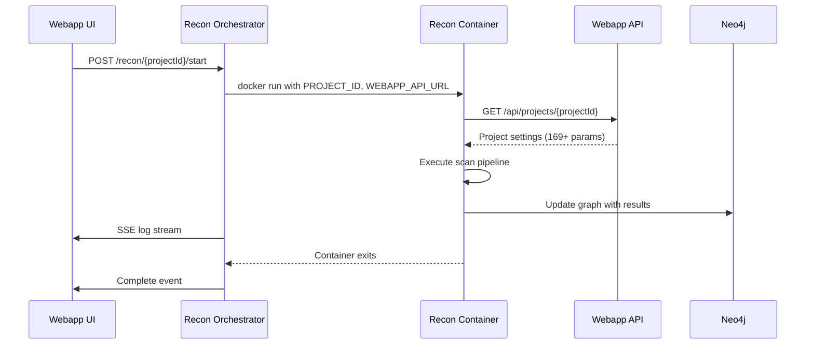

---

## 🏗️ Docker-in-Docker Architecture

The recon module uses a **Docker-in-Docker (DinD)** pattern where the main recon container orchestrates sibling containers for each scanning tool.

### How It Works

The recon container shares the **host's Docker daemon** via a socket mount, meaning all containers are **siblings** managed by the same host Docker daemon.

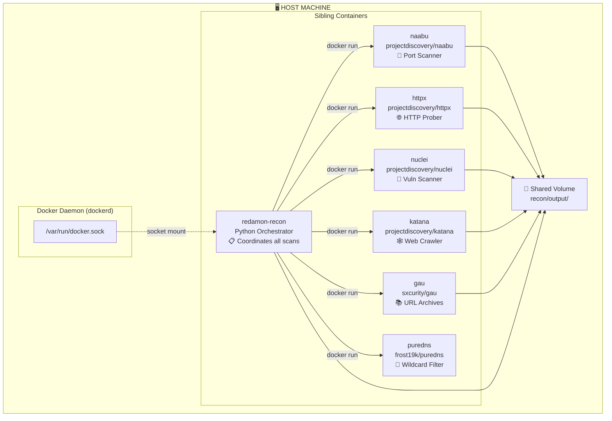

### Container Execution Flow (Parallelized)

The pipeline uses a **fan-out / fan-in** pattern with `ThreadPoolExecutor` to run independent modules concurrently, significantly reducing total scan time while respecting data dependencies between groups.

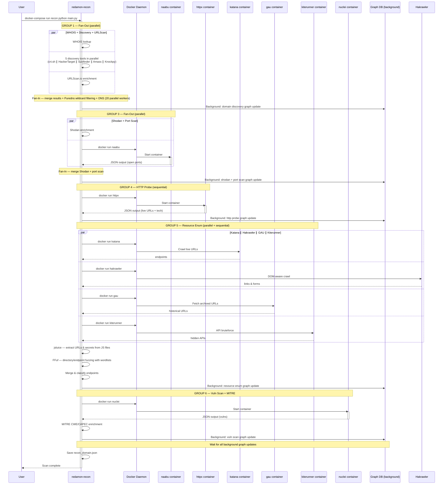

### Why Docker-in-Docker?

| Benefit | Description |
|---------|-------------|
| **Isolation** | Each tool runs in its own container with minimal dependencies |
| **Consistency** | Same tool versions regardless of host OS |
| **No host pollution** | Go binaries (naabu, httpx, nuclei) don't need to be installed on host |
| **Easy updates** | Just pull new Docker images to update tools |
| **Portability** | Works on any system with Docker installed |

---

## 🔄 Scanning Pipeline Overview

RedAmon executes scans in a **parallelized pipeline** using a fan-out / fan-in pattern. Independent modules within each group run concurrently via `ThreadPoolExecutor`, while groups that depend on prior results run sequentially. Graph DB updates happen in a dedicated background thread so the main pipeline is never blocked.

### High-Level Pipeline

```mermaid
flowchart LR
    subgraph Input["📥 Input"]
        Domain[🌐 Target Domain]
    end

    subgraph G1["GROUP 1 — parallel fan-out"]
        DD[WHOIS]
        SUB[Subdomain Discovery<br/>5 tools in parallel]
        URLSCAN[URLScan.io]
    end

    subgraph G3["GROUP 3 — parallel fan-out"]
        SHODAN[Shodan Enrichment]
        PS[Port Scan — Naabu]
    end

    subgraph G4["GROUP 4 — sequential"]
        HP[HTTP Probe<br/>Httpx + Wappalyzer]
    end

    subgraph G5["GROUP 5 — parallel + sequential"]
        RE[Resource Enum<br/>Katana ∥ Hakrawler ∥ GAU ∥ ParamSpider ∥ Kiterunner<br/>then jsluice → FFuf → Arjun]
    end

    subgraph G6["GROUP 6 — sequential"]
        VS[Vuln Scan — Nuclei<br/>+ MITRE Enrichment]
    end

    subgraph Output["📤 Output"]
        JSON[(recon_domain.json)]
        Graph[(Neo4j Graph<br/>background updates)]
    end

    Domain --> G1
    G1 -->|fan-in: merge + puredns filter| G3
    G3 -->|fan-in: merge| G4
    G4 --> G5
    G5 --> G6
    G6 --> JSON
    JSON --> Graph
```

### Detailed Module Flow (Parallelized)

The pipeline uses **fan-out / fan-in** concurrency: modules within each group run in parallel threads, and results are merged before the next group starts. Graph DB writes happen in a single-writer background thread that never blocks the main pipeline.

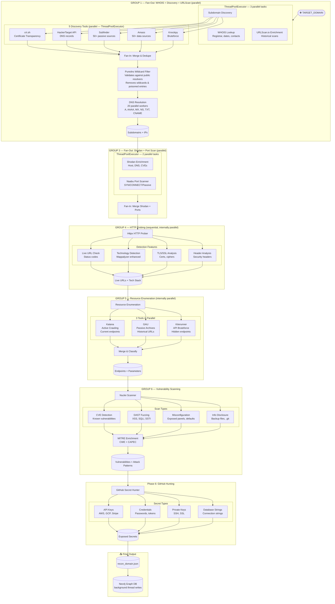

### Data Enrichment Flow

```mermaid
flowchart LR
    subgraph Discovery["Discovery Phase"]
        Sub[Subdomains] --> IP[IP Addresses]
        IP --> Port[Open Ports]
        Port --> Service[Services]
    end

    subgraph Analysis["Analysis Phase"]
        Service --> URL[Live URLs]
        URL --> Tech[Technologies]
        Tech --> Endpoint[Endpoints]
    end

    subgraph Assessment["Assessment Phase"]
        Endpoint --> Vuln[Vulnerabilities]
        Vuln --> CVE[CVE IDs]
        CVE --> CWE[CWE Weaknesses]
        CWE --> CAPEC[CAPEC Attacks]
    end

    subgraph Graph["Graph Storage"]
        CAPEC --> Neo4j[(Neo4j)]
    end
```

---

## ⚡ Parallelization Architecture

The recon pipeline uses a **fan-out / fan-in** pattern with Python's `concurrent.futures.ThreadPoolExecutor` to run independent modules concurrently, significantly reducing total scan time while respecting data dependencies.

### Execution Groups

| Group | Modules | Parallelism | Dependencies |
|-------|---------|-------------|--------------|
| **GROUP 1** | WHOIS + Subdomain Discovery + URLScan | 3 parallel tasks | Only needs `root_domain` |
| *Discovery* | crt.sh + HackerTarget + Subfinder + Amass + Knockpy | 5 parallel tools | Part of GROUP 1 |
| *Puredns* | Wildcard filtering (validates against public resolvers) | Sequential | After discovery fan-in, before DNS |
| *DNS* | DNS resolution for all subdomains | 20 parallel workers | After puredns filtering |
| **GROUP 3** | Shodan Enrichment + Port Scan (Naabu) | 2 parallel tasks | Needs IPs from GROUP 1 |
| **GROUP 4** | HTTP Probe (httpx) | Sequential (internally parallel) | Needs ports from GROUP 3 |
| **GROUP 5** | Resource Enum (Katana + GAU + Kiterunner) | 3 tools internally parallel | Needs live URLs from GROUP 4 |
| **GROUP 6** | Vuln Scan (Nuclei) + MITRE Enrichment | Sequential | Needs endpoints from GROUP 5 |

### Background Graph DB Updates

All Neo4j graph updates run in a **dedicated single-writer background thread** (`ThreadPoolExecutor(max_workers=1)`). The main pipeline submits deep-copy snapshots of recon data and continues immediately. A final `_graph_wait_all()` ensures all updates complete before the pipeline exits.

### Structured Logging

All log messages use a consistent `[level][Module]` prefix format (e.g., `[+][crt.sh] Found 42 subdomains`) for clarity when multiple tools produce interleaved output from concurrent threads.

### Thread Safety

Each parallelized tool function is thread-safe:
- Discovery tools (`query_crtsh`, `query_hackertarget`, etc.) create their own `requests.Session` instances
- Module `_isolated` variants (e.g., `run_port_scan_isolated`, `run_shodan_enrichment_isolated`) accept a read-only snapshot of `combined_result` and return only their data section
- The main thread handles all merging — no shared mutable state between workers

---

## 📋 Scan Modules Explained

### Configure Which Modules to Run

Configure via the webapp project settings or environment variables:

```bash
# Run all modules (recommended for full assessment)
SCAN_MODULES="domain_discovery,port_scan,http_probe,resource_enum,vuln_scan"

# Quick recon only (no vulnerability scanning)
SCAN_MODULES="domain_discovery"

# Port scan + HTTP probing (skip vulnerability scanning)
SCAN_MODULES="domain_discovery,port_scan,http_probe"
```

### Module 1: `domain_discovery`

All 5 subdomain discovery tools run **concurrently** via `ThreadPoolExecutor(max_workers=5)`. Each tool is a thread-safe function with its own HTTP session. After merging, **Puredns** validates the combined list against public DNS resolvers to remove wildcard and DNS-poisoned entries. DNS resolution is then parallelized with **20 concurrent workers**. WHOIS and URLScan run in a separate parallel group alongside discovery.

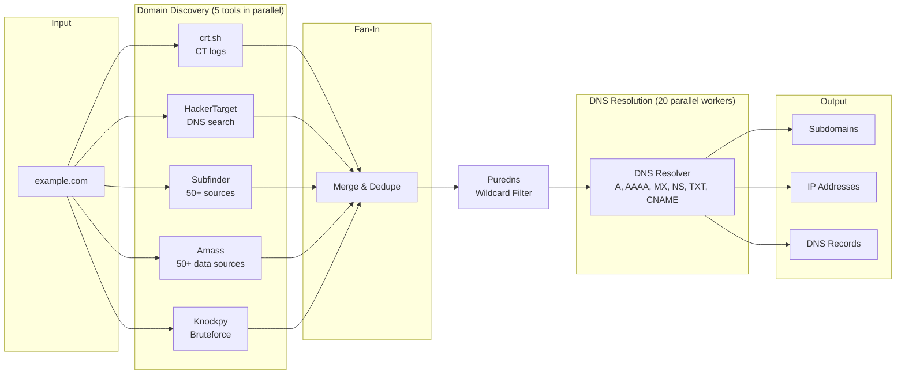

| What It Does | Output |
|--------------|--------|
| **WHOIS lookup** | Registrar, creation date, owner info |
| **Subdomain discovery** | Finds subdomains via 5 parallel sources (crt.sh, HackerTarget, Subfinder, Amass, Knockpy) |
| **Wildcard filtering** | Puredns validates subdomains against public DNS resolvers, removes wildcards and DNS-poisoned entries |
| **DNS enumeration** | A, AAAA, MX, NS, TXT, CNAME records (20 parallel workers) |
| **IP resolution** | Maps all discovered hostnames to IPs |

📖 **Key Parameters:**
```python
TARGET_DOMAIN = "example.com"           # Root domain
SUBDOMAIN_LIST = []                     # Empty = discover ALL
USE_BRUTEFORCE_FOR_SUBDOMAINS = False   # Brute force mode
```

---

### Module 2: `port_scan`

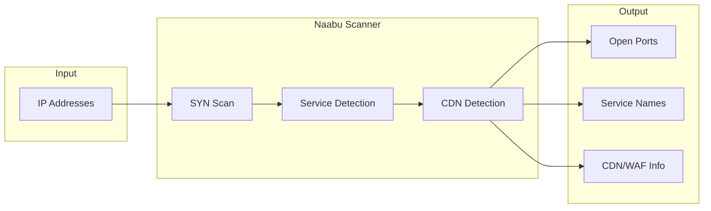

| What It Finds | Examples |
|---------------|----------|
| **Open ports** | 22/SSH, 80/HTTP, 443/HTTPS, 3306/MySQL |
| **CDN detection** | Cloudflare, Akamai, Fastly |
| **Service hints** | Common service identification |

📖 **Key Parameters:**
```python
NAABU_TOP_PORTS = "1000"        # Number of top ports
NAABU_RATE_LIMIT = 1000         # Packets per second
NAABU_SCAN_TYPE = "s"           # SYN scan
```

📖 **Detailed documentation:** [readmes/README.PORT_SCAN.md](README.PORT_SCAN.md)

---

### Module 3: `http_probe`

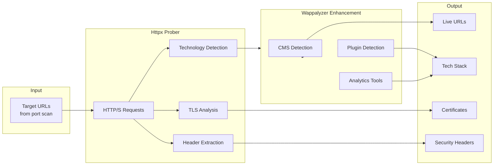

| What It Finds | Examples |
|---------------|----------|
| **Live URLs** | Which endpoints are responding |
| **Technologies** | WordPress, nginx, PHP, React |
| **CMS Plugins** | Yoast SEO, WooCommerce (via Wappalyzer) |
| **TLS certificates** | Issuer, expiry, SANs |

📖 **Detailed documentation:** [readmes/README.HTTP_PROBE.md](README.HTTP_PROBE.md)

---

### Module 4: `resource_enum`

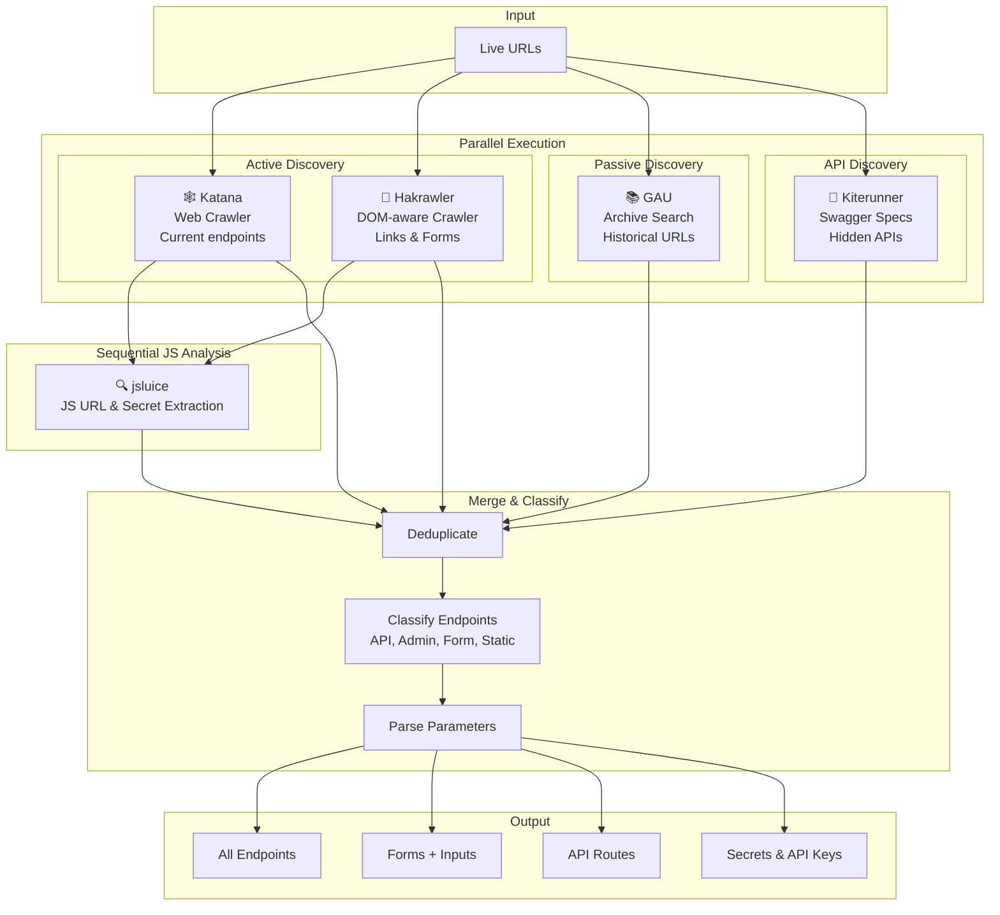

| Tool | Method | What It Finds |
|------|--------|---------------|
| **Katana** | Active crawling | Current live endpoints |
| **Hakrawler** | Active crawling | Links, forms, DOM-discovered URLs |
| **GAU** | Passive archives | Historical/deleted pages |
| **Kiterunner** | API bruteforce | Hidden API routes |
| **jsluice** | Passive JS analysis | URLs, endpoints, and secrets from JS files |

📖 **Detailed documentation:** [readmes/README.RESOURCE_ENUM.md](README.RESOURCE_ENUM.md)

---

### Module 5: `vuln_scan`

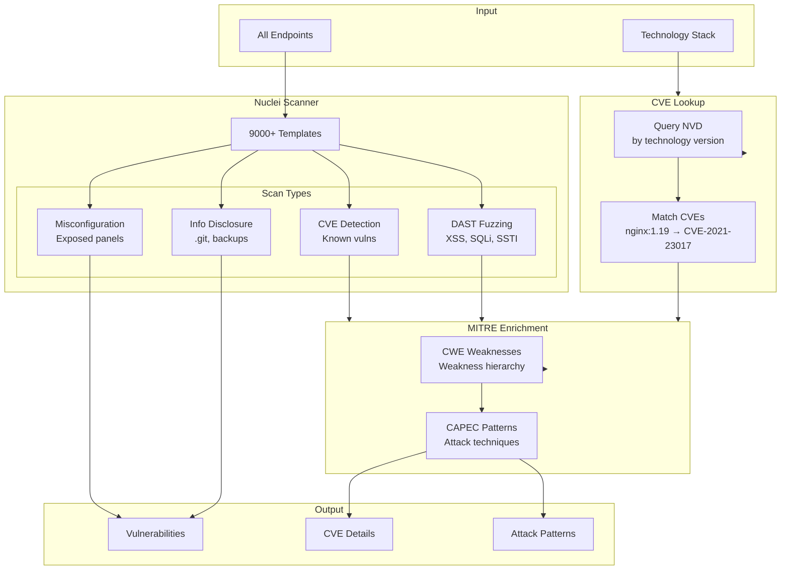

| What It Finds | Examples |
|---------------|----------|
| **Web CVEs** | Log4Shell, Spring4Shell |
| **Injection flaws** | SQL injection, XSS |
| **Misconfigurations** | Exposed admin panels |
| **CWE Weaknesses** | Weakness hierarchy |
| **CAPEC Attacks** | Attack techniques |

📖 **Detailed documentation:** [readmes/README.VULN_SCAN.md](README.VULN_SCAN.md) | [readmes/README.MITRE.md](README.MITRE.md)

---

### Module 6: `github`

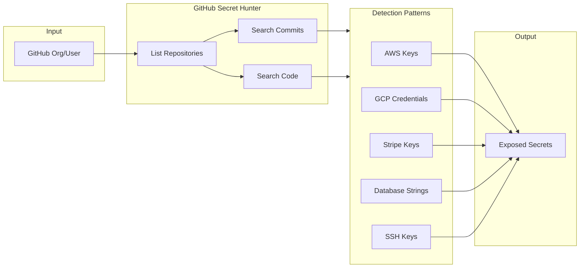

---

## 🆚 Complete Tool Comparison

### Overview Matrix

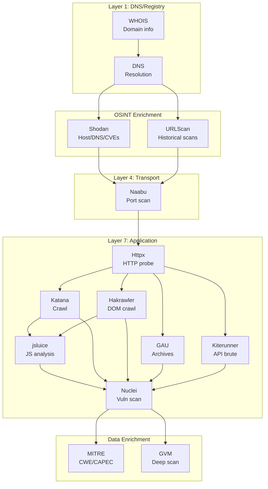

### Feature Comparison

| Feature | WHOIS | DNS | Shodan | URLScan | Naabu | httpx | Katana | Hakrawler | GAU | Kiterunner | jsluice | Nuclei | GVM |
|---------|-------|-----|--------|---------|-------|-------|--------|-----------|-----|------------|---------|--------|-----|
| **Domain Info** | ✅ | ⚠️ | ❌ | ❌ | ❌ | ❌ | ❌ | ❌ | ❌ | ❌ | ❌ | ❌ | ❌ |
| **IP Resolution** | ❌ | ✅ | ⚠️ | ⚠️ | ⚠️ | ✅ | ❌ | ❌ | ❌ | ❌ | ❌ | ❌ | ❌ |
| **Subdomain Discovery** | ❌ | ❌ | ⚠️ | ✅ | ❌ | ❌ | ❌ | ❌ | ❌ | ❌ | ❌ | ❌ | ❌ |
| **Port Scanning** | ❌ | ❌ | ⚠️ | ❌ | ✅ | ❌ | ❌ | ❌ | ❌ | ❌ | ❌ | ❌ | ✅ |
| **Live URL Check** | ❌ | ❌ | ❌ | ❌ | ❌ | ✅ | ❌ | ❌ | ❌ | ❌ | ❌ | ❌ | ❌ |
| **Tech Detection** | ❌ | ❌ | ⚠️ | ⚠️ | ❌ | ✅ | ❌ | ❌ | ❌ | ❌ | ❌ | ⚠️ | ⚠️ |
| **Endpoint Discovery** | ❌ | ❌ | ❌ | ⚠️ | ❌ | ❌ | ✅ | ✅ | ✅ | ✅ | ⚠️ | ❌ | ❌ |
| **Historical URLs** | ❌ | ❌ | ❌ | ✅ | ❌ | ❌ | ❌ | ❌ | ✅ | ❌ | ❌ | ❌ | ❌ |
| **API Discovery** | ❌ | ❌ | ❌ | ❌ | ❌ | ❌ | ❌ | ❌ | ❌ | ✅ | ❌ | ❌ | ❌ |
| **CVE Detection** | ❌ | ❌ | ✅ | ❌ | ❌ | ❌ | ❌ | ❌ | ❌ | ❌ | ❌ | ✅ | ✅ |
| **External Domains** | ❌ | ❌ | ❌ | ✅ | ❌ | ⚠️ | ⚠️ | ⚠️ | ⚠️ | ❌ | ⚠️ | ❌ | ❌ |
| **XSS/SQLi Testing** | ❌ | ❌ | ❌ | ❌ | ❌ | ❌ | ❌ | ❌ | ❌ | ❌ | ❌ | ✅ | ⚠️ |
| **Secret Detection** | ❌ | ❌ | ❌ | ❌ | ❌ | ❌ | ❌ | ❌ | ❌ | ❌ | ✅ | ❌ | ❌ |

**Legend:** ✅ Primary | ⚠️ Limited | ❌ Not supported

### Timing Comparison

| Tool | Typical Duration | Notes |
|------|------------------|-------|
| WHOIS | <1 second | Instant |
| DNS | <1 second | Instant |
| Shodan | 5-15 seconds | Passive, per-IP queries |
| URLScan | 5-20 seconds | Passive, API rate-limited |
| Amass | 1-10 minutes | Passive; longer with active/brute |
| Puredns | 30-90 seconds | Depends on subdomain count |
| Naabu | 5-10 seconds | 1000 ports |
| httpx | 10-30 seconds | All options |
| Katana | 1-5 minutes | Crawl depth 3 |
| Hakrawler | 30-120 seconds | Active crawling, depth 2 |
| GAU | 10-30 seconds | Passive |
| jsluice | 10-60 seconds | Passive JS analysis |
| Nuclei | 1-30 minutes | Depends on templates |
| GVM | 30 min - 2+ hours | Full scan |

---

## ⚙️ Key Configuration Parameters

### Essential Settings

All settings are managed through the webapp project form or via environment variables. Key defaults are defined in `project_settings.py`:

| Setting | Default | Description |
|---------|---------|-------------|
| `TARGET_DOMAIN` | — | Root domain to scan |
| `SUBDOMAIN_LIST` | `[]` | Empty = discover all |
| `SCAN_MODULES` | all 5 modules | Modules to run |
| `NAABU_TOP_PORTS` | `"1000"` | Top-N ports to scan |
| `NAABU_SCAN_TYPE` | `"s"` | SYN scan |
| `NUCLEI_DAST_MODE` | `true` | Active fuzzing |
| `NUCLEI_SEVERITY` | critical, high, medium, low | Severity filter |
| `WAPPALYZER_ENABLED` | `true` | Technology detection |
| `MITRE_INCLUDE_CWE` | `true` | CWE enrichment |
| `MITRE_INCLUDE_CAPEC` | `true` | CAPEC enrichment |

---

## 🔧 Prerequisites

### Docker Mode (Recommended)

- **Docker** with Docker Compose
- **Docker socket access** for nested container execution

```bash
# Verify Docker is running
docker info

# Build and run
cd recon/
docker-compose build --network=host
docker-compose run --rm recon python /app/recon/main.py
```

### Tool Containers (auto-pulled)

| Tool | Docker Image | Purpose |
|------|--------------|---------|
| Naabu | `projectdiscovery/naabu:latest` | Port scanning |
| httpx | `projectdiscovery/httpx:latest` | HTTP probing |
| Nuclei | `projectdiscovery/nuclei:latest` | Vuln scanning |
| Katana | `projectdiscovery/katana:latest` | Web crawling |
| GAU | `sxcurity/gau:latest` | URL discovery |
| Amass | `caffix/amass:latest` | Subdomain enumeration |
| Puredns | `frost19k/puredns:latest` | Wildcard filtering |

---

## 📁 Project Structure

```
recon/
├── Dockerfile              # Container build
├── docker-compose.yml      # Orchestration
├── project_settings.py     # 🔗 Settings fetcher (API or built-in defaults)
├── main.py                 # 🚀 Entry point
├── domain_recon.py         # Subdomain discovery
├── whois_recon.py          # WHOIS lookup
├── urlscan_enrich.py       # URLScan.io OSINT enrichment
├── port_scan.py            # Port scanning
├── http_probe.py           # HTTP probing
├── resource_enum.py        # Endpoint discovery
├── vuln_scan.py            # Vulnerability scanning
├── add_mitre.py            # MITRE enrichment
├── github_secret_hunt.py   # GitHub secrets
├── output/                 # 📄 Scan results (JSON)
├── data/                   # 📦 Cached databases
│   ├── mitre_db/           # CVE2CAPEC database
│   └── wappalyzer/         # Technology rules
├── helpers/                # Tool helpers
└── readmes/                # 📖 Module docs
```

---

## 📊 Output Format

All modules write to: `recon/output/recon_<domain>.json`

```mermaid
flowchart TB
    subgraph JSON["recon_domain.json"]
        Meta[metadata<br/>scan info, timestamps]
        WHOIS[whois<br/>registrar, dates]
        Subs[subdomains<br/>discovered hosts]
        DNSData[dns<br/>A, MX, TXT records]
        Ports[port_scan<br/>open ports, services]
        HTTP[http_probe<br/>live URLs, tech stack]
        Resources[resource_enum<br/>endpoints, forms]
        Vulns[vuln_scan<br/>CVEs, misconfigs]
        TechCVE[technology_cves<br/>version-based CVEs]
    end

    Meta --> WHOIS
    WHOIS --> Subs
    Subs --> DNSData
    DNSData --> Ports
    Ports --> HTTP
    HTTP --> Resources
    Resources --> Vulns
    Vulns --> TechCVE
```

---

## 🧪 Test Targets

Safe, **legal** targets for security testing:

| Target | Technology | Vulnerabilities |
|--------|------------|-----------------|
| `testphp.vulnweb.com` | PHP + MySQL | SQLi, XSS, LFI |
| `testhtml5.vulnweb.com` | HTML5 | DOM XSS |
| `testasp.vulnweb.com` | ASP.NET | SQLi, XSS |
| `scanme.nmap.org` | N/A | Port scanning only |

```python
# Example configuration
TARGET_DOMAIN = "vulnweb.com"
SUBDOMAIN_LIST = ["testphp."]
NUCLEI_DAST_MODE = True
```

---

## ⚠️ Legal Disclaimer

**Only scan systems you own or have explicit written permission to test.**

Unauthorized scanning is illegal. RedAmon is intended for:
- Penetration testers with proper authorization
- Security researchers on approved targets
- Bug bounty hunters within program scope
- System administrators testing their infrastructure

---

## 📖 Detailed Documentation

| Module | Documentation |
|--------|---------------|
| Port Scan | [readmes/README.PORT_SCAN.md](README.PORT_SCAN.md) |
| HTTP Probe | [readmes/README.HTTP_PROBE.md](README.HTTP_PROBE.md) |
| Vuln Scan | [readmes/README.VULN_SCAN.md](README.VULN_SCAN.md) |
| MITRE CWE/CAPEC | [readmes/README.MITRE.md](README.MITRE.md) |
| GVM/OpenVAS | [README.GVM.md](README.GVM.md) |
